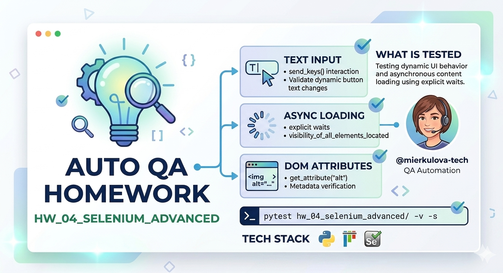

# HW 04 — Selenium Advanced: Dynamic Elements & Waits



Testing dynamic UI behavior and asynchronous content loading using explicit waits.

## Project structure

```
hw_04_selenium_advanced/
├── test_change_text.py.py      ← verifies button label updates after input
├── test_images_download.py    ← validates delayed images and their attributes
└── README.md
```

## Run tests

```bash
# Run all tests in the directory
pytest hw_04_selenium_advanced/ -v -s

```

## What is tested

| Feature           | Description |
|:------------------| :--- |
| **Text Input**    | Interaction with send_keys() and validating dynamic button text changes. |
| **Async Loading** | Handling delayed content using visibility_of_all_elements_located. |
| **DOM Attributes**| Retrieving and verifying metadata using get_attribute("alt"). |

## Tech stack

- Python 3.x
- Pytest
- Selenium WebDriver
